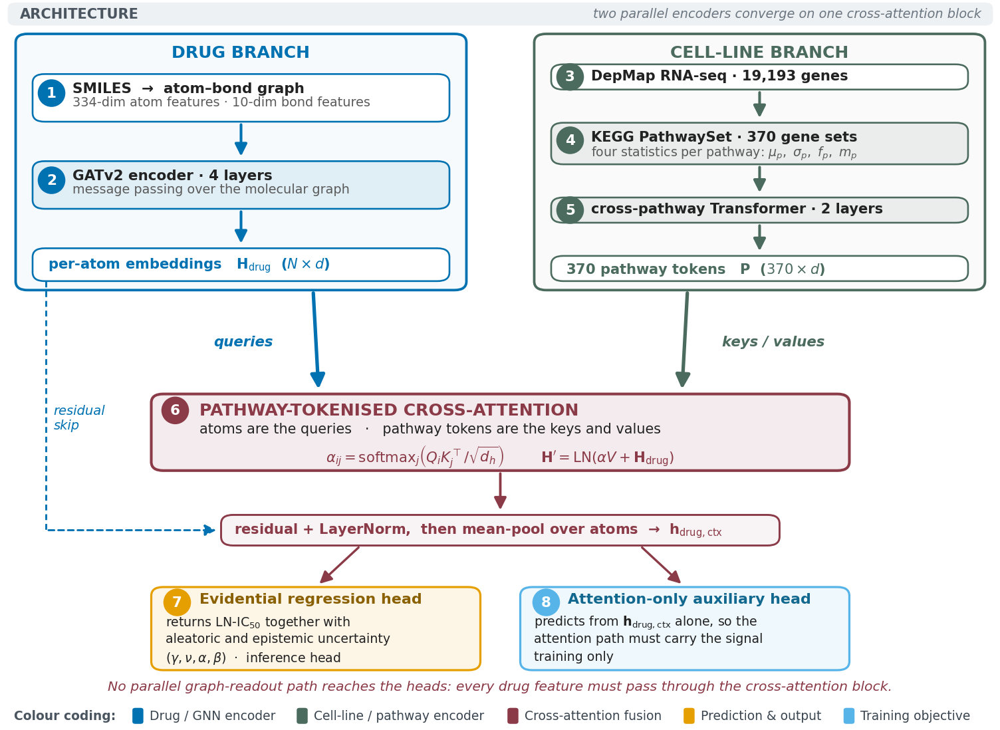
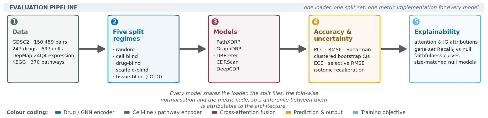
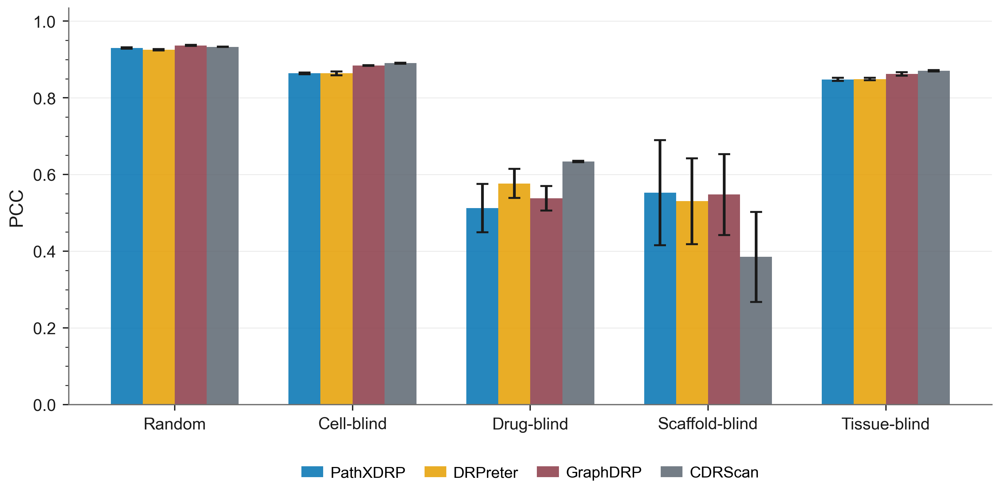
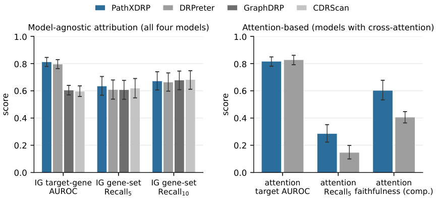
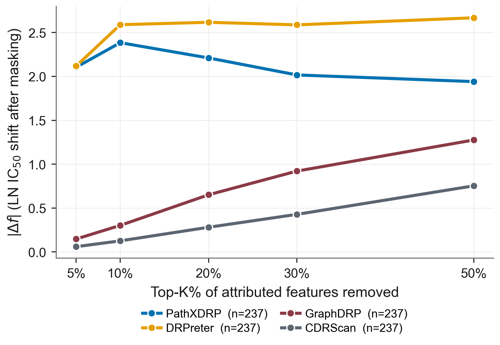

# PathXDRP

**A reproducible evaluation toolkit and quantitative explainability
benchmark for graph-based drug response prediction.**

This repository releases the code, the curated mechanism-of-action (MoA)
benchmark, the deterministic cross-validation splits and the per-run metrics
behind the paper:

> Gouda, A. H., Zaky, A. B., Anter, A. M. *PathXDRP: a pathway-masked
> cross-attention model and quantitative explainability benchmark for drug
> response prediction.* Submitted to *Knowledge-Based Systems*.

The manuscript PDF and LaTeX sources are distributed separately (Zenodo /
journal); they are not part of this code release.

---

## Model architecture



Two parallel encoders converge on one cross-attention block. The drug branch
turns a SMILES string into an atom–bond graph and encodes it with a four-layer
GATv2. The cell branch reduces a DepMap RNA-seq profile to four statistics per
KEGG gene set and refines the resulting 370 pathway tokens with a two-layer
Transformer. Cross-attention treats atoms as queries and pathway tokens as keys
and values; a residual connection with Layer Normalisation and a mean pool over
atoms produce the drug-in-context vector, read by an evidential regression head
and, during training only, by an attention-only auxiliary head. There is no
parallel graph-readout path to the heads, so every drug feature has to pass
through the attention block.

## Evaluation pipeline



Every model shares the loader, the split files, the fold-wise normalisation and
the metric code, so a difference between them is attributable to the
architecture rather than to the harness.

---

## What you get

1. **PathXDRP** — a graph + pathway cross-attention model with a
   residual + LayerNorm wrapped attention block and an attention-only
   auxiliary loss that keeps the attention path load-bearing. The
   regression head returns evidential uncertainty in a single forward pass.
2. **Four reimplemented DRP baselines** sharing the same data loaders,
   splits, training loop and metric pipeline:
   - GraphDRP (Nguyen et al. 2021) — GIN drug encoder + 1D-CNN over expression.
   - DRPreter (Shin et al. 2023) — GATv2 drug + pathway Transformer cell +
     unmasked cross-attention.
   - CDRScan (Chang et al. 2018) — Morgan fingerprints + expression MLP.
   - DeepCDR (Liu et al. 2020) — expression-only configuration, added during
     revision; see the caveat under [Headline results](#headline-results).
3. **Five-split protocol** — `random`, `cell_blind`, `drug_blind`,
   `scaffold_blind`, `tissue_blind` — five seeds each, deterministic
   row-index files regenerated from the GDSC2 raw file by
   [`scripts/build_splits.py`](scripts/build_splits.py). The index files
   themselves are ~73 MB and are **not** committed; the builder is
   deterministic, so running it reproduces them exactly.
4. **Quantitative XAI benchmark** — cross-attention, integrated gradients
   on expression, integrated gradients on atom features, permutation
   importance, and occlusion, scored against 237 curated MoA drugs with
   target-gene AUROC, gene-set recall *K*, sensitivity alignment, and
   ROAR-style faithfulness curves, each against a size-matched null.
5. **Calibration metrics** — Expected Calibration Error, risk–coverage
   curves and selective RMSE at coverage 50 / 70 / 90 / 100 %.

---

## Headline results

<!-- BEGIN HEADLINE TABLE -->
| Split | PathXDRP | DRPreter | GraphDRP | CDRScan |
| --- | --- | --- | --- | --- |
| random | 0.930 ± 0.002 | 0.925 ± 0.002 | **0.937 ± 0.001** | 0.933 ± 0.001 |
| cell-blind | 0.864 ± 0.002 | 0.864 ± 0.005 | 0.884 ± 0.001 | **0.890 ± 0.001** |
| drug-blind | 0.513 ± 0.063 | 0.577 ± 0.038 | 0.538 ± 0.032 | **0.634 ± 0.002** |
| scaffold-blind | **0.553 ± 0.137** | 0.530 ± 0.112 | 0.548 ± 0.106 | 0.385 ± 0.117 |
| tissue-blind | 0.848 ± 0.004 | 0.849 ± 0.004 | 0.862 ± 0.004 | **0.871 ± 0.002** |

<sub>Test Pearson correlation on GDSC2 LN-IC50, mean ± population standard deviation over 5 seeds (fold 0). Bold marks the best model per split. Generated from `revision/outputs/ledger_summary.csv` by `revision/scripts/readme_table.py`; these are the values in Table 4 of the manuscript.</sub>
<!-- END HEADLINE TABLE -->



**Read these margins with the clustered bootstrap, not the table.** Rows of a
drug-cell matrix are dependent, so a row-level bootstrap badly overstates
significance. Under a bootstrap clustered by drug and by cell line, most
between-model differences above are not significant, and a Friedman test across
the five splits cannot separate the four architectures (chi2 = 4.44, p = 0.218).
PathXDRP is **competitive on accuracy, not better**. Its contribution is the
dead-attention diagnosis, the measured attention faithfulness, and the
uncertainty output. See
[`revision/outputs/clustered_bootstrap_summary.md`](revision/outputs/clustered_bootstrap_summary.md).

DeepCDR is reported separately in
[`revision/outputs/deepcdr_results.md`](revision/outputs/deepcdr_results.md):
it runs here in an expression-only configuration because this benchmark carries
no mutation or methylation channel, so its numbers are below those in the
original paper and are not a reproduction of them.

### Explainability



The XAI benchmark — not raw accuracy — is the central contribution of this
repo. Tables and masking-based faithfulness curves are written by
[`scripts/run_xai_multimodel.py`](scripts/run_xai_multimodel.py)
and [`scripts/run_xai_modelagnostic.py`](scripts/run_xai_modelagnostic.py)
to [`results/xai/`](results/xai/).



Comprehensiveness |Δf| as the top-*K*% of attributed features are removed.
Higher and more monotone is more faithful.

---

## Where the numbers come from

Every headline number in this README is generated, not typed:

```
results/<model>/<split>_seed<S>_fold0.json     # one file per run
   -> revision/scripts/build_ledger.py         # -> revision/outputs/ledger.csv
   -> revision/scripts/readme_table.py         # -> the table above
```

`python revision/scripts/readme_table.py --check` exits non-zero if the table
above has drifted from `results/`. The same values come out of the repository's
own aggregator, `python eval/analyze_results.py --metrics PCC`, which is what
produced the manuscript's tables.

Two conventions matter, and getting them wrong is what previously put this
README out of step with the paper:

- **Only `<split>_seed<S>_fold0.json` counts towards a headline mean.** The
  revision added fold-wise-normalisation reruns (`_fw`), leave-one-tissue-out
  folds (`_fold1..4_fw`) and head ablations (`_abA`..`_abF`) to the same model
  directories. They are legitimate results with their own tables, but a glob of
  `*_fold*.json` sweeps them into the headline means.
- **The dispersion is the population standard deviation (ddof=0)**, matching
  `eval/analyze_results.py` and the manuscript. The sample standard deviation
  is 11.8% larger over five seeds — enough to move nine of the twenty cells.

> **Note on earlier versions of this table.**
> Until 2026-08 this README reported PathXDRP random PCC as 0.919 and
> scaffold-blind as 0.441, and stated that PathXDRP "does not lead on raw IC50
> correlation on any split". Those numbers came from
> `results/summary_v3_vs_baselines.csv`, a stale aggregate written before the
> final PathXDRP sweep: sixteen of its twenty-five PathXDRP runs had stopped at
> epoch ≤ 2 under a learning-rate schedule that was later fixed, and four
> baseline runs were double-counted. The manuscript always reported the final
> sweep in `results/<model>/*.json`; the README was never regenerated. That
> file has been removed from `results/` and kept as
> [`revision/outputs/stale_summary_v3_vs_baselines.csv`](revision/outputs/stale_summary_v3_vs_baselines.csv)
> so the audit stays reproducible.
> A later draft corrected the means but reported sample standard deviations, so
> nine of the twenty error bars still disagreed with the paper in the third
> decimal. Both defects are fixed above, and `readme_table.py --check` guards
> against a recurrence. Full audit:
> [`revision/outputs/readme_discrepancy_audit.md`](revision/outputs/readme_discrepancy_audit.md).

---

## Repository layout

```
.
├── pathxdrp/                # source: model, baselines, data, eval, explain
│   ├── models/              # PathXDRP model
│   ├── baselines/           # GraphDRP, DRPreter, CDRScan, DeepCDR
│   ├── data/                # graph builder, loader, split utilities
│   ├── eval/                # metrics + risk/coverage
│   ├── explain/             # XAI benchmark + model-agnostic attribution
│   └── train.py             # PathXDRP training entry point
├── scripts/                 # CLI runners (data prep, sweeps, XAI, validation)
├── eval/                    # results aggregation + plotting
├── revision/                # analyses added for the KBS revision
│   ├── scripts/             # ledger, clustered bootstrap, calibration, LOTO,
│   │                        #   ablation, XAI controls, PRISM transfer
│   ├── outputs/             # their .md / .csv reports, including the ledger
│   └── tables/              # the LaTeX tables the manuscript includes
├── tests/                   # smoke tests
├── configs/default.yaml     # PathXDRP hyperparameter config
├── data/processed/          # curated MoA benchmark, pathway map, ID maps, SMILES
├── results/                 # current per-run metrics, predictions, XAI outputs
│   ├── pathxdrp/ graphdrp/ drpreter/ cdrscan/ deepcdr/   # JSON + preds CSV per run
│   ├── xai/                 # XAI benchmark outputs
│   ├── external/            # PRISM cross-platform evaluation
│   └── benchmarks/          # inference-latency measurements
├── figures/                 # the figures this README displays
├── REPRODUCIBILITY.md       # table-by-table provenance, environment, seeds
└── requirements.txt
```

What is **not** in the repo:

- **Raw data** (GDSC2 CSVs, DepMap RNA-seq matrix, PRISM bulk downloads, KEGG
  dumps, Open Targets files). Fetch from the upstream providers — see
  [Data sources](#data-sources) below.
- **Split index files** (`data/processed/splits/`, ~73 MB). Regenerate
  deterministically with `scripts/build_splits.py`.
- **Trained checkpoints** (~4.3 GB total). Reproduce with
  `scripts/run_sweep.py` on a CUDA GPU.
- **Per-run training logs**, **archived sweeps**, and **generated figures
  other than the ones displayed above**. All regeneratable from the code.
- **Manuscript LaTeX sources and compiled PDFs.** Distributed separately
  through Zenodo / the journal.

---

## Reproducing the paper

### 0. Environment

```bash
pip install -r requirements.txt
```

`torch-scatter`, `torch-sparse` and `torch-cluster` must be installed
against your CUDA version — follow the PyG install instructions.
The exact versions behind the published runs are in
[REPRODUCIBILITY.md](REPRODUCIBILITY.md).

### 1. Fetch and prepare data

```bash
# DepMap 24Q4 RNA-seq matrix into data/raw/
python scripts/download_expression.py

# Canonical SMILES from PubChem PUG-REST
python scripts/fetch_smiles.py

# KEGG pathway -> gene map
python scripts/build_pathway_mask.py

# Five-split row-index files (deterministic)
python scripts/build_splits.py

# Curated mechanism-of-action benchmark for the XAI evaluation
python scripts/build_moa_benchmark.py --all
```

You will also need the GDSC2 dose-response CSV (`GDSC2-dataset.csv`) at the
repo root. Download it from CancerRxGene bulk downloads (release 8.4); see
[Data sources](#data-sources).

After this step the curated artefacts live under `data/processed/`:

| File                              | Contents                                    | In repo |
| --------------------------------- | ------------------------------------------- | ------- |
| `moa_benchmark.json`              | Curated 25-drug MoA panel (manual review)   | yes |
| `moa_benchmark_all.json`          | 237-drug auto-curated MoA list              | yes |
| `pathway_gene_map.json`           | 370 KEGG pathways → 8,403 unique genes      | yes |
| `cosmic_to_depmap.csv`            | 946 GDSC2 cells → DepMap ModelID            | yes |
| `drugs_with_smiles.parquet`       | 247 / 295 GDSC2 drugs with PubChem SMILES   | yes |
| `splits/`                         | Five splits × five seeds × row-index files  | no — rebuild |

### 2. Run the full sweep

```bash
python scripts/run_sweep.py
```

This trains every (model × split × seed) combination and writes one JSON
plus a predictions CSV per run under `results/<model>/`. Wall-clock time
is ≈ 33 hours on a single RTX 3060 Laptop GPU; a desktop card cuts it
substantially.

Single-run commands — the published protocol is **not** the entry points'
default and has to be passed explicitly:

```bash
python -u -m pathxdrp.train --split random --seed 0 --fold 0 \
    --epochs 50 --early_stop_patience 10 --lr 5e-4 --batch_size 64
python -u scripts/train_baseline.py --model graphdrp --split random --seed 0 --fold 0 \
    --epochs 50 --early_stop_patience 10 --lr 5e-4 --batch_size 64
```

### 3. Aggregate, plot, and run the XAI benchmark

```bash
python eval/analyze_results.py --latex          # writes the LaTeX tables
python eval/plot_results.py                     # writes PDFs/PNGs to figures/

python scripts/run_xai_multimodel.py            # cross-model attention + IG → results/xai/
python scripts/run_xai_modelagnostic.py         # ROAR-style faithfulness curves
python scripts/xai_aggregate.py                 # unified summary across methods
```

The unified XAI summary lands at
[`results/xai/xai_unified_summary.json`](results/xai/xai_unified_summary.json),
with per-model breakdowns in `xai_multimodel_<model>.json` and
`xai_modelagnostic_<model>.json`.

### 4. Rebuild the ledger and the revision analyses

```bash
python revision/scripts/build_ledger.py         # canonical per-run ledger
python revision/scripts/readme_table.py         # rewrites the table above
python revision/scripts/clustered_bootstrap.py  # drug/cell-clustered CIs
python revision/scripts/calibration_study.py    # ECE, selective RMSE, recalibration
python revision/scripts/loto_audit.py           # leave-one-tissue-out spread
python revision/scripts/xai_controls.py         # size-matched null models
python revision/scripts/prism_analysis.py       # cross-platform transfer
```

Each writes a `.md` report and a `.csv` to `revision/outputs/`, and the
table-emitting ones also write LaTeX to `revision/tables/`.
[REPRODUCIBILITY.md](REPRODUCIBILITY.md) maps every manuscript table and figure
to the script that produces it.

### 5. Optional: external validation

```bash
python scripts/prepare_prism.py                 # PRISM bulk files -> data/external/
python scripts/external_validation.py           # PRISM; writes results/external/
python scripts/ensemble_eval.py                 # multi-seed ensembling
python scripts/diagnose_attention.py            # PathXDRP attention diagnostics
```

---

## Data sources

This repository does **not** redistribute primary data. All sources are
public and should be obtained from their providers:

- **GDSC2 dose-response** — Genomics of Drug Sensitivity in Cancer, release
  8.4 — <https://www.cancerrxgene.org/downloads/bulk_download>.
- **DepMap 24Q4 RNA-seq** —
  `OmicsExpressionProteinCodingGenesTPMLogp1.csv` from
  <https://depmap.org/portal/download/all/>.
- **PRISM Repurposing secondary screen** — DepMap portal, same download page.
- **KEGG human pathway–gene mappings** — fetched live through the KEGG REST
  API by `scripts/build_pathway_mask.py`.
- **PubChem canonical SMILES** — fetched live through PUG-REST by
  `scripts/fetch_smiles.py`.

After all filtering steps (cells with RNA-seq, drugs with SMILES, valid
IC50 rows), the final dataset comprises **150,459 rows × 247 drugs × 697
cells** drawn from the original 242,036-row GDSC2 release.

---

## Citation

Pending acceptance. Once published, citation metadata will be added here
and in the Zenodo record.
